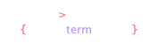
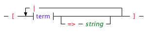
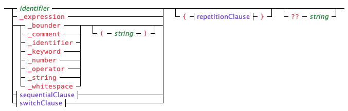

## DSL Specification DSL

This section will define the full grammar of the DSL that is used by the
[`LexicalDslFactory`](../Dsl/LexicalDslFactory.cs) class for defining the grammar for a
DSL.

Similar to old-style BNF constructs, you will find it easier in the long run to define
more, smaller clauses in your DSL specification, building up more complex constructs from
the smaller ones.  This encourages reuse of clauses and keeps the mental gymnastics of
understanding a DSL's grammar to a minimum.  See the
[`LexicalParserFactory.DSL.cs`](../Dsl/LexicalParserFactory.DSL.cs) file for a working
example.  The specification there defines Lex's parser factory DSL.

At this time, the language only supports token types and clause parsers provided by the Lex
library; if you need to define your own token types and clause parsers, they cannot be made
available through the [`Dsl`](../Dsl/Dsl.cs) class.  That said, you will likely never need
to write your own clause parsers except for very specific situations.

### The Top Level

There are four types of clauses you'll put in a DSL specification.  The first type is a
simple clause that sets the specification for a lexical parser that can parse the DSL.
The second type will be definitions of individual tokens you want to match on in subsequent
clauses.  You do not need to define token _types_ as all the available ones are defined for
you.  The third type is used to define what an expression may look like.  The last type
will be specifications of all the clause parsers you need.  The syntax of the whole
specification looks like this:

<picture>
  <source media="(prefers-color-scheme: dark)" srcset="images/dsl-dsl/top-level-dark.png">
  <source media="(prefers-color-scheme: light)" srcset="images/dsl-dsl/top-level.png">
  
</picture>

When defining named sequential or switch clauses, there may be times when circular
references, which may take the form of two clauses that refer to each other, or a clause
that needs to refer to itself, are required.  You support this by specifying the definition
of the clause twice.  The first time, the clause must be defined empty.  The second
time should contain the full definition.  If you need to enable debugging for a clause in
this case, do so on the second occurrence, not the first.  When the DSL factory finds this
situation, it takes the second declaration as a continuation of the first.  **Note:** use
such clauses with care as the grammar can become problematic.

You may specify one, and only one, switch clause without a leading label that will act as
the top-level clause parser for the DSL.  Typically, this will contain the clause parsers
for each of your top-level language constructs.  You will likely want to include a tag for
each one os that you may easily know which clause the top-level clause parser captured.

### Lexical Parser Specification

One of the things the [`Dsl`](../Dsl/Dsl.cs) class can do is create and configure a lexical
parser that is able to parse the given language.  If you want to do this, include the parser
specification clause in the specification of your DSL.

<picture>
  <source media="(prefers-color-scheme: dark)" srcset="images/dsl-dsl/parserSpecificationClause-dark.png">
  <source media="(prefers-color-scheme: light)" srcset="images/dsl-dsl/parserSpecificationClause.png">
  
</picture>

The specification is a simple string that defines the tokenizers for the parser using the
[lexical parser DSL](parser-factory-dsl.md).  You'll probably want to use a triple-quoted
string to keep this more readable.  Note that the specification will not be validated until
the DSL's `CreateLexicalParser()` method is actually called.

Here is how you would do this to define the specification for the lexical parser
factory:

```
_parserSpec: """
    standard comments
    dsl keywords
    identifiers
    single quoted strings
    double quoted strings
    integral numbers
    bounders
    dsl operators
    whitespace
    """
```

Notice that the keywords and operator clauses specifically reference those defined in the
DSL specification.  This is the best pattern to follow unless you have an excellent reason
not to.

### Defining Keywords

There are actually two different ways to specify keywords.  The first is by specifying the
`_keywords` labeled clause.  A comma delimited list of strings, each of which represents one
of your keywords, must follow the colon, `:`, that follows `_keywords`.

<picture>
  <source media="(prefers-color-scheme: dark)" srcset="images/dsl-dsl/keywordsClause-dark.png">
  <source media="(prefers-color-scheme: light)" srcset="images/dsl-dsl/keywordsClause.png">
  
</picture>

Each string specified in the list must contain letters only.

The second way to define a keyword is to do so the way the
[arbitrary token definition](#defining-arbitrary-tokens) section describes.

### Defining Operators

As with keywords, there are two different ways to specify operators.  The first is by
specifying the `_operators` labeled clause.  A comma delimited list of identifiers, each
of which represents an operator to include in the DSL, must follow the colon, `:`, that
follows `_operators`.

<picture>
  <source media="(prefers-color-scheme: dark)" srcset="images/dsl-dsl/operatorsClause-dark.png">
  <source media="(prefers-color-scheme: light)" srcset="images/dsl-dsl/operatorsClause.png">
  
</picture>

Each identifier in the comma-delimited list may be,

- `predefined` -- This includes all the operator tokens that are defined as constants on
  the [`OperatorToken`](../Tokens/OperatorToken.cs) class.
- The name of one of the operator tokens that are defined as constants on the
  [`OperatorToken`](../Tokens/OperatorToken.cs) class.  The name is matched in a
  case-insensitive way.
- The name of an operator token defined using the arbitrary token definition clause.  Listing
  an operator token defined this way is technically redundant, but may be desirable for
  documenting all operators in one place.

The second way to define an operator is to do so as the
[arbitrary token definition](#defining-arbitrary-tokens) section describes.

### Defining Arbitrary Tokens

You may define tokens to use in subsequent expressions or matching clauses with
the arbitrary token clause.  It is made up of a label (an identifier followed by
a colon, `:`), then a type and a string surrounded by parentheses.

<picture>
  <source media="(prefers-color-scheme: dark)" srcset="images/dsl-dsl/arbitraryTokenClause-dark.png">
  <source media="(prefers-color-scheme: light)" srcset="images/dsl-dsl/arbitraryTokenClause.png">
  
</picture>

For example, to define a square operator using the Unicode character for a superscripted
2, and name it, `squared`, you would use this:

```
squared: _operator("²")
```

or alternately,

```
squared: _operator("\u00b2")
```

Once this is defined, you can then use it later in the DSL spec as follows:

```
squaredNumber: { _number > squared }
```

which will match when a number token is followed by the `squared` operator token.  (See
below for defining a token series clause.)

It can also be set up as a postfix unary operator in an expression like so:

```
_expressions:
{
    unary: [ *squared, ... ]
}
```

### Defining the Form of Expressions

You define what an expression looks like in your DSL by providing an expression definition
specification after the `_expressions:` label.

<picture>
  <source media="(prefers-color-scheme: dark)" srcset="images/dsl-dsl/expressionClause-dark.png">
  <source media="(prefers-color-scheme: light)" srcset="images/dsl-dsl/expressionClause.png">
  
</picture>

In the expression specification clause, you'll define what terms can look like, what
unary, binary and trinary operators to support, if any and what text to use for various
exceptions that the expression parser can parse.  You must at least specify what terms
can look like; otherwise the expression parser would be useless.

### Defining Expression Term Forms

You define what forms a term in an expression can take by providing a comma-delimited
list of expression term definition specifications between square brackets after the
`term:` label inside the `_expressions:` specification.

<picture>
  <source media="(prefers-color-scheme: dark)" srcset="images/dsl-dsl/expressionTerm-dark.png">
  <source media="(prefers-color-scheme: light)" srcset="images/dsl-dsl/expressionTerm.png">
  
</picture>

Each form of a term must be composed of a series of one or more items, each of which
can be a token, a token type, or a nested expression reference.

A token may be specified by referring to its variable name where that name was established
by the `_keywords` or `_operators` clauses or by an arbitrary token definition clause.  You
may also define a token in place by specifying a type identifier followed by a string in
parentheses, similar to the arbitrary token definition clause.  Items that resolve to a
token may be preceded by the forward slash, `/`, to indicate that they need not be reported
to the expression parser's tree builder.

A type may be specified by including a type identifier.

A nested expression may be included by specifying the `_expression` identifier.  If a
parenthetical clause is not specified after that, it is assumed that one, and only one
nested expression must be present in the source token stream.  You'll get the same
outcome if you specify an empty pair of parentheses; i.e, `(` followed immediately by `)`.

If there is content between the parentheses, the first item must be a repetition clause
which will control how many nested expressions are required and allowed.  If the maximum
allowed is more than one, the repetition clause may be followed by a comma and then a
comma-delimited list of separators.  Each separator may be one or more tokens that note
what must be present in the parsed token stream to separate the nested expressions.

The last item that may appear in the term specification is a tag clause, introduced by the
arrow, `=>`, operator followed by a string.  The value of this string is passed to the
current tree builder when the expression parser calls its `CreateTerm()` method.  Tagging
term forms like this makes for an easy way for that method to know what to expect regarding
the tokens and nested expressions the expression parser found.

As an example, this is what a specification for a function call might look like:

```
_expressions:
{
    term: [ _identifier /leftParen _expression(*, comma) /rightParen => 'function' ]
}
```

This will report the token that matches the identifier token type, the list of nested
terms and the tag, `function` to the tree builder's `CreateTerm()` method.

### Defining Unary Operators

You define your set of supported unary operators by providing a comma-delimited list of
unary operation definitions between square brackets after the `unary:` label inside the
`_expressions:` specification.

<picture>
  <source media="(prefers-color-scheme: dark)" srcset="images/dsl-dsl/unaryTerm-dark.png">
  <source media="(prefers-color-scheme: light)" srcset="images/dsl-dsl/unaryTerm.png">
  
</picture>

Each unary operation must be composed of a series of one or more tokens or a colon followed
by the `postfixFirst` identifier.  By default, the expression parser applies prefix unary
operators before any postfix operators.  Specifying `:postfixFirst` in the unary operation
list will reverse this.

If a unary operation token series is followed by an `*`, the operation is registered as a
prefix operation.  If the token series is preceded by an `*`, it is registered as a postfix
operation.  It is allowed to mark an operation as both, by including an `*` at both ends.
At least one `*` is required.

### Defining Binary Operators

You define your set of supported binary operators by providing a comma-delimited list of
binary operation definitions between square brackets after the `binary:` label inside the
`_expressions:` specification.

<picture>
  <source media="(prefers-color-scheme: dark)" srcset="images/dsl-dsl/binaryTerm-dark.png">
  <source media="(prefers-color-scheme: light)" srcset="images/dsl-dsl/binaryTerm.png">
  
</picture>

Each binary operation must be composed of a series of one or more tokens followed by an
optional precedence notation.  If the binary operator is made up of only one token which
is one of the predefined operators, the precedence notation may be omitted and the default
precedence value for that operation will be used.  You can still specify it if you want to
override that default.  The set of predefined precedence values may be found in the
[`OperatorPrecedence`](../Expressions/OperatorPrecedence.cs) enum.

### Defining Trinary Operators

You define your set of supported trinary operators by providing a comma-delimited list of
binary operation definitions between square brackets after the `trinary:` label inside the
`_expressions:` specification.

<picture>
  <source media="(prefers-color-scheme: dark)" srcset="images/dsl-dsl/trinaryTerm-dark.png">
  <source media="(prefers-color-scheme: light)" srcset="images/dsl-dsl/trinaryTerm.png">
  
</picture>

Each trinary operation must be composed of a pair of one or more tokens separated by a
comma and surrounded by parentheses.  The first token list represents the left-hand
operator which will be expected to be between the first and second terms.  The second token
list represents the right-hand operator which will be expected to be between the second
and third terms.

### Customizing Expression Parsing Exception Text

You may customize the text that the expression parser will include in parsing exceptions
that it runs across.  You do so by providing a comma-delimited list of message specifications
(though, for this clause, the separating comma is optional).  These must appear between square
brackets after the `messages:` label inside the `_expressions:` specification.

<picture>
  <source media="(prefers-color-scheme: dark)" srcset="images/dsl-dsl/messages-dark.png">
  <source media="(prefers-color-scheme: light)" srcset="images/dsl-dsl/messages.png">
  
</picture>

Each message specification must be composed of the symbolic name of the message, followed
by a colon, `:`, followed by a non-empty string that contains the text you want to use.
Some messages will be given a text argument to include.  Refer to the
[`ExpressionParseMessageTypes`](../Expressions/ExpressionParseMessageTypes.cs) enum for
details.

### Defining a Sequential Clause

You define a sequential clause for matching a series of sub-clauses by providing an
identifier to become the name by which the clause will be known, followed by a colon, `:`
and then the sequential clause itself.  This may optionally be followed by the double arrow
operator, `=>`, and a string.  Finally, a [repetition clause](#the-repetition-clause) may be given.

<picture>
  <source media="(prefers-color-scheme: dark)" srcset="images/dsl-dsl/defineSequentialClause-dark.png">
  <source media="(prefers-color-scheme: light)" srcset="images/dsl-dsl/defineSequentialClause.png">
  
</picture>

If the double arrow clause is provided, the string will contain the tag that the sequential
clause parser should report when it succeeds in capturing tokens.

If the question mark, `?`, is specified between the colon, `:` and the sequential clause,
this will enable debugging for the clause.  This may also be done programmatically via
the `Dsl` instance that is being built.

### The Sequential Clause

You initiate a sequential clause for matching a series of sub-clauses by providing an
open brace, `{`. This must be followed by at least one term.  Multiple terms should be 
separated by the greater-than sign, `>`.  The clause must be ended with a closing brace,
`}`.

<picture>
  <source media="(prefers-color-scheme: dark)" srcset="images/dsl-dsl/sequentialClause-dark.png">
  <source media="(prefers-color-scheme: light)" srcset="images/dsl-dsl/sequentialClause.png">
  
</picture>

### Defining a Switch Clause

You define a switch clause for matching one of a collection of sub-clauses by providing an
identifier to become the name by which the clause will be known, followed by a colon, `:`
and then the switch clause itself.  This may optionally be followed by the coalesce operator,
`??`, and a string.  Finally, a [repetition clause](#the-repetition-clause) may be given.

<picture>
  <source media="(prefers-color-scheme: dark)" srcset="images/dsl-dsl/defineSwitchClause-dark.png">
  <source media="(prefers-color-scheme: light)" srcset="images/dsl-dsl/defineSwitchClause.png">
  
</picture>

If the coalesce clause is provided, the string will contain the text of an error message to
include in a token exception that will be thrown when the clause parser is unable to match
any of its sub-clauses.

If the question mark, `?`, is specified between the colon, `:` and the sequential clause,
this will enable debugging for the clause.  This may also be done programmatically via
the `Dsl` instance that is being built.

### The Switch Clause

You initiate a switch clause for matching one of a collection of sub-clauses by providing an
open bracket, `[`. This must be followed by at least one term.  Multiple terms should be
separated by the pipe character, `|`.  Each term may optionally be followed by the double
arrow operator, `=>` and a string to set the text of the tag that the switch clause parser
will report when the specific term is matched.  The clause must be ended with a closing
bracket,
`]`.

<picture>
  <source media="(prefers-color-scheme: dark)" srcset="images/dsl-dsl/switchClause-dark.png">
  <source media="(prefers-color-scheme: light)" srcset="images/dsl-dsl/switchClause.png">
  
</picture>

### The Term Clause

The term clause represents a sub-clause of a sequential or switch clause.  It may be one
of five things:

- An identifier.  In this case, the term represents a previously defined keyword, operator
  or other type of token.
- An expression.  In this case, the parser will use the expression parser defined in the
  DSL to parse an expression tree.
- A token type.  In this case, the term represents matching on a type of token.  If the
  optional parenthetical clause is given, then a new token of the indicated type is created
  to match on.
- A nested sequential clause.
- A nested switch clause.

<picture>
  <source media="(prefers-color-scheme: dark)" srcset="images/dsl-dsl/term-dark.png">
  <source media="(prefers-color-scheme: light)" srcset="images/dsl-dsl/term.png">
  
</picture>

When the term is an expression, it is important to know that, at that point, any terms
that follow it must parse successfully since parsing an expression consumes all the
relevant tokens, preventing the containing clause from being rolled back as happens, say,
when a sequence isn't fully captured.  As such, you'll want to include an error message
on all terms in the clause that follow the expression.

This may optionally be followed by a [repetition clause](#the-repetition-clause).  Finally,
a coalesce operator and string may be provided.

If the coalesce clause is provided, the string will contain the text of an error message to
include in a token exception that will be thrown when the term clause parser is unable to
capture any tokens.

### The Repetition Clause

You can put limits on how many times a clause is allowed or required to repeat by using a
repetition clause where appropriate.

<picture>
  <source media="(prefers-color-scheme: dark)" srcset="images/dsl-dsl/repetitionClause-dark.png">
  <source media="(prefers-color-scheme: light)" srcset="images/dsl-dsl/repetitionClause.png">
  
</picture>

In the number form of the clause, both numbers are optional.  The number that precedes
the range operator, `..`, is the minimum number of required times a clause must occur.  If
it is not specified, it defaults to `0`; i.e., no minimum.  The number that follows the
range operator is the maximum number of times a clause may repeat.  If it is not specified.
then there is no limit.

The single character forms are shorthand for specifying these limits:

- `+` -- a minimum of one and no maximum; the clause must match at least once but can then
  match any number of times.
- `*` -- no minimum and no maximum; the clause may match any number of times, including not
  at all.
- `?` -- no minimum and a maximum of one; the clause may appear once or not at all, i.e.,
  it's optional.
