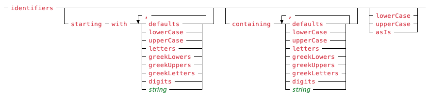

## The Parser Factory DSL

This section will define the full grammar of the DSL that is used by the
[`LexicalParserFactory`](../Dsl/LexicalParserFactory.cs) class for creating and configuring
a lexical parser.

At this time, the language only supports tokenizers provided by the Lex library; if you
need to define your own tokenizers, you'll need to create and configure your lexical parsers
by hand.

### The Top Level

At the top level, the parser factory DSL is comprised by a series of clauses.  Each clause
specifies a single type of tokenizer to add to the parser being created.  Order does matter
as each clause specified will be executed in the given order when processing the next character
from the source the parser is to parse.  A given type of tokenizer may only be added once to
the parser; string tokenizers are an exception (sort of) to this (we'll talk about that
later).

<picture>
  <source media="(prefers-color-scheme: dark)" srcset="images/parser-dsl/top-level-dark.png">
  <source media="(prefers-color-scheme: light)" srcset="images/parser-dsl/top-level.png">
  
</picture>

You may specify either `report` or `redact` at the end of a tokenizer clause to control
whether tokens from that tokenizer are reported to you or swallowed by the parser.  By
default, the whitespace and comments tokenizers will _redact_ (swallow) tokens they parse
and all other token types will report theirs.

### The Based Number Tokenizer Clause

See the [based number tokenizer](the-tokenizers.md#the-based-number-tokenizer) documentation
for details about how the tokenizer that this clause produces works.

This is the syntax for specifying a based number tokenizer:

<picture>
  <source media="(prefers-color-scheme: dark)" srcset="images/parser-dsl/basedNumbersClause-dark.png">
  <source media="(prefers-color-scheme: light)" srcset="images/parser-dsl/basedNumbersClause.png">
  
</picture>

By default, the based number tokenizer can parse literals in any of the 3 supported bases.
The optional, `no` clauses may be specified to suppress the parsing of the noted bases.
For example, if you wanted to support hexadecimal literals only, you'd use:

```
based numbers no octal no binary
```

### The Bounder Tokenizer Clause

See the [bounder tokenizer](the-tokenizers.md#the-bounder-tokenizer) documentation for details
about how the tokenizer that this clause produces works.

This is the syntax for specifying a bounder tokenizer:

<picture>
  <source media="(prefers-color-scheme: dark)" srcset="images/parser-dsl/boundersClause-dark.png">
  <source media="(prefers-color-scheme: light)" srcset="images/parser-dsl/boundersClause.png">
  
</picture>

If the optional `of` clause is given the string must contain **all** characters you want
to be recognized as bounders.

### The Standard Comments Tokenizer Clause

See the [comment tokenizer](the-tokenizers.md#the-comment-tokenizer) documentation for details
about how the tokenizer that this clause produces works.

This is the syntax for specifying a standard comments tokenizer:

<picture>
  <source media="(prefers-color-scheme: dark)" srcset="images/parser-dsl/standardCommentsClause-dark.png">
  <source media="(prefers-color-scheme: light)" srcset="images/parser-dsl/standardCommentsClause.png">
  
</picture>

You may use the optional `or` clause as many times as needed to register any extra comment
markers you would like the tokenizer to look for.

### The Comments Tokenizer Clause

See the [comment tokenizer](the-tokenizers.md#the-comment-tokenizer) documentation for details
about how the tokenizer that this clause produces works.

This is the syntax for specifying a comments tokenizer:

<picture>
  <source media="(prefers-color-scheme: dark)" srcset="images/parser-dsl/commentsClause-dark.png">
  <source media="(prefers-color-scheme: light)" srcset="images/parser-dsl/commentsClause.png">
  
</picture>

You may use the optional `or` clause as many times as needed to register any extra comment
markers you would like the tokenizer to look for.

### The Identifier Tokenizer Clause

See the [identifier tokenizer](the-tokenizers.md#the-identifier-tokenizer) documentation for
details about how the tokenizer that this clause produces works.

This is the syntax for specifying an identifier tokenizer:

<picture>
  <source media="(prefers-color-scheme: dark)" srcset="images/parser-dsl/identifiersClause-dark.png">
  <source media="(prefers-color-scheme: light)" srcset="images/parser-dsl/identifiersClause.png">
  
</picture>

You may use the optional `starting with` clause to specify what characters you want to allow
for starting an identifier.  Specifying `defaults` will include both upper- and lower-case
letters and the underscore as starting characters.

You may use the optional `containing` clause to specify what characters you want to allow
for the rest of an identifier.  Specifying `defaults` will include both upper- and lower-case
letters, digits and the underscore as starting characters.

You may use the optional style clause to set the style on the tokenizer.

Specifying `identifiers` by itself is equivalent to `identifiers starting with letters, '_'
containing letters, digits, '_'`.

### The Sourced Keywords Tokenizer Clause

See the [keyword tokenizer](the-tokenizers.md#the-keyword-tokenizer) documentation for details
about how the tokenizer that this clause produces works.

This is the syntax for specifying a sourced keyword tokenizer:

<picture>
  <source media="(prefers-color-scheme: dark)" srcset="images/parser-dsl/sourcedKeywordsClause-dark.png">
  <source media="(prefers-color-scheme: light)" srcset="images/parser-dsl/sourcedKeywordsClause.png">
  
</picture>

The set of keywords to configure the tokenizer with may come from your language specification,
as represented by an instance of the [`Dsl`](../Dsl/Dsl.cs) class.  (You create these by
providing the source specification to the `CreateFrom()` method of the
[`LexicalParserFactory`](../Dsl/LexicalParserFactory.cs) class.).  For this to work, you
must provide your DSL instance to the `CreateFrom()` method of the
[`LexicalParserFactory`](../Dsl/LexicalParserFactory.cs) class.

You may use the optional `including` clause to add additional keywords to those pulled from
your language specification DSL.  You may use the optional `excluding` clause to remove
keywords defined in your language specification DSL that you don't want to be recognized by
the tokenizer.  Both clauses require a comma-delimited list of items, each of which may be
a string or an identifier.  If an item is an identifier, it is treated as an unquoted string.

You may use the optional style clause to set the style on the tokenizer.

### The Keywords Tokenizer Clause

See the [keyword tokenizer](the-tokenizers.md#the-keyword-tokenizer) documentation for details
about how the tokenizer that this clause produces works.

This is the syntax for specifying a keyword tokenizer:

<picture>
  <source media="(prefers-color-scheme: dark)" srcset="images/parser-dsl/keywordsClause-dark.png">
  <source media="(prefers-color-scheme: light)" srcset="images/parser-dsl/keywordsClause.png">
  
</picture>

The comma-delimited list of strings or identifiers (interpreted here essentially as unquoted
strings) make up the list of keywords that the tokenizer should recognize.

You may use the optional style clause to set the style on the tokenizer.

### The Numbers Tokenizer Clause

See the [number tokenizer](the-tokenizers.md#the-number-tokenizer) documentation for details
about how the tokenizer that this clause produces works.

This is the syntax for specifying a number tokenizer:

<picture>
  <source media="(prefers-color-scheme: dark)" srcset="images/parser-dsl/numbersClause-dark.png">
  <source media="(prefers-color-scheme: light)" srcset="images/parser-dsl/numbersClause.png">
  
</picture>

You may use the optional `integral` prefix to create a tokenizer that will recognize numeric
literals without fractions.

You may use the optional `decimal` prefix to create a tokenizer that will recognize numeric
literals with fractions, but not scientific notation.

You may use the optional `with signs` clause to have the tokenizer include leading signs,
`+` or `-`, in recognized numeric literals.  If you also specify an operator tokenizer that
includes the sign characters, be sure to specify the `numers` clause before the relevant
operators clause.  Specifying the operators clause first, will make the `with signs` clause
on the number tokenizer meaningless.

### The Sourced Operators Tokenizer Clause

See the [operator tokenizer](the-tokenizers.md#the-operator-tokenizer) documentation for details
about how the tokenizer that this clause produces works.

This is the syntax for specifying a sourced operator tokenizer:

<picture>
  <source media="(prefers-color-scheme: dark)" srcset="images/parser-dsl/sourcedOperatorsClause-dark.png">
  <source media="(prefers-color-scheme: light)" srcset="images/parser-dsl/sourcedOperatorsClause.png">
  
</picture>

The set of operators to configure the tokenizer with may come from either the full default
set as defined in the [`OperatorToken`](../Tokens/OperatorToken.cs) class or your language
specification, as represented by an instance of the [`Dsl`](../Dsl/Dsl.cs) class.  (You
create these by providing the source specification to the `CreateFrom()` method of the
[`LexicalParserFactory`](../Dsl/LexicalParserFactory.cs) class.).  For pulling the operator
list from your DSL, you must provide your DSL instance to the `CreateFrom()` method of the
[`LexicalParserFactory`](../Dsl/LexicalParserFactory.cs) class.

You may use the optional `including` clause to add additional operators to the predefined
set or those pulled from your language specification DSL.  You may use the optional
`excluding` clause to remove keywords defined in the predefined set or your language
specification DSL that you don't want to be recognized by the tokenizer.  Both clauses
require a comma-delimited list of items, each of which may be a string or an identifier.
If an item is an identifier, it is taken as the name (case-insensitive) of one of the
constants defined on the [`OperatorToken`](../Tokens/OperatorToken.cs) class.

### The Operators Tokenizer Clause

See the [operator tokenizer](the-tokenizers.md#the-operator-tokenizer) documentation for details
about how the tokenizer that this clause produces works.

This is the syntax for specifying an operator tokenizer:

<picture>
  <source media="(prefers-color-scheme: dark)" srcset="images/parser-dsl/operatorsClause-dark.png">
  <source media="(prefers-color-scheme: light)" srcset="images/parser-dsl/operatorsClause.png">
  
</picture>

The comma-delimited list of strings or identifiers make up the list of operators that the
tokenizer should recognize.  If an item in the list is an identifier, it is taken as the
name of a constant define on the [`OperatorToken`](../Tokens/OperatorToken.cs) class.

### The Strings Tokenizer Clause

See the appropriate tokenizer documentation for details about how each string tokenizer
that this clause produces works:

- `single quoted strings` -- [single-quoted string tokenizer](the-tokenizers.md#the-single-quoted-string-tokenizer)
- `double quoted strings` -- [double-quoted string tokenizer](the-tokenizers.md#the-double-quoted-string-tokenizer)
- `triple quoted strings` -- [triple-quoted string tokenizer](the-tokenizers.md#the-triple-quoted-string-tokenizer)
- `strings bounded by` -- [string tokenizer](the-tokenizers.md#the-number-tokenizer)

This is the syntax for specifying a string tokenizer:

<picture>
  <source media="(prefers-color-scheme: dark)" srcset="images/parser-dsl/stringsClause-dark.png">
  <source media="(prefers-color-scheme: light)" srcset="images/parser-dsl/stringsClause.png">
  
</picture>

#### `single quoted strigs`

This form of the `strings` clause creates a string tokenizer that uses the single quote as
a string literal bounder.  Include the optional `multiChar` clause to have the tokenizer
allow for string literals of any length.  By default, the single-quoted form enforces string
literals to be exactly one character long (after any character escaping has been handled).

#### `double quoted strigs`

This form of the `strings` clause creates a string tokenizer that uses the double quote as
a string literal bounder.

#### `triple quoted strigs`

This form of the `strings` clause creates a string tokenizer that uses three consecutive
double quote characters as a string literal bounder.  Include the option `single line`
clause to force the resulting tokenizer to recognize only string literals that do not span
lines.  By default, the triple-quoted tokenizer allows for literals that can span lines.
Include the optional `not extensible` clause to prevent the resulting tokenizer from
allowing the double-quote character from extending into more than three occurrences for
bounding the string literal.  By default, this ability to extend is allowed.

#### `strigs bounded by`

This form of the `strings` clause creates a string tokenizer that uses the provided string
as the bounder for a string literal.  Include the optional `multiLine` clause to allow
string literals to span multiple lines.  By default, they must start and end on the same
line.

#### All Forms

Include the optional `raw` clause to suppress character escape sequence resolution from
being performed on parsed string literals.  By default, escape sequences will be resolved
to the character they represent.  Include the optional `repeat to escape` to allow the
string literal bounder to be repeated as a way to escape the bounder itself so that it may
be included in a string literal.  This is separate from the `raw` setting.  By default,
this is set to `false`.

### The Whitespace Tokenizer Clause

See the [whitespace tokenizer](the-tokenizers.md#the-whitespace-tokenizer) documentation for
details about how the tokenizer that this clause produces works.

This is the syntax for specifying a whitespace tokenizer:

<picture>
  <source media="(prefers-color-scheme: dark)" srcset="images/parser-dsl/whitespaceClause-dark.png">
  <source media="(prefers-color-scheme: light)" srcset="images/parser-dsl/whitespaceClause.png">
  
</picture>

You may include the optional `with separated lineEnds` clause to have the tokenizer report
line ends as separate tokens from other whitespace.
